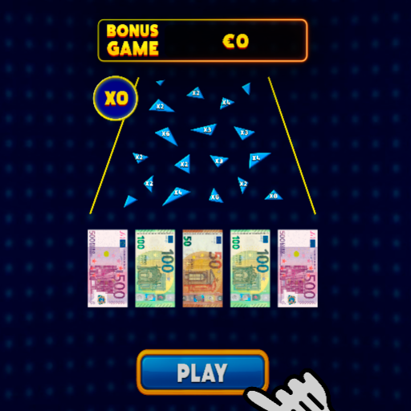
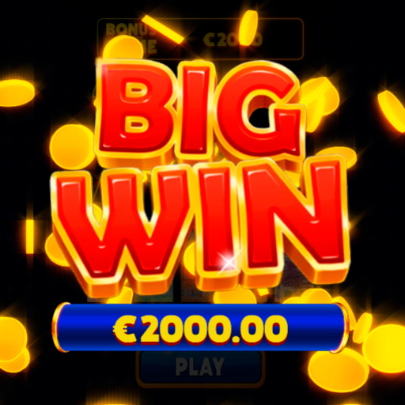

# Cocos Paintball Game

## 📌 Описание
Это мой первый проект на Cocos Creator 3.8.6 , вдохновленный механикой пейнтбола и игровыми механиками с элементами физики. 
Игрок наблюдает за падением шарика. Шарик, падая, сталкивается с препятствиями с множителями и в конце касается с купюрами (50, 100, 500), умножая общий счёт на значение купюры. Итог — эффектная надпись "BIG WIN!".

## 🖼️ Скриншоты

